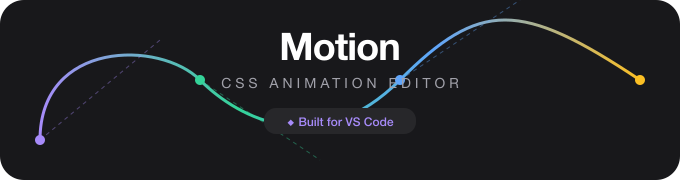
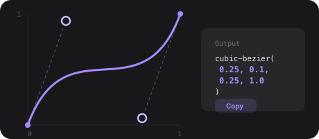
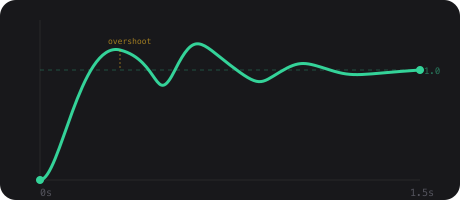
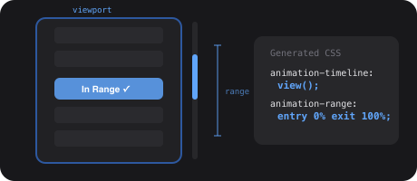
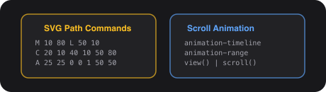

<div align="center">

<!-- ═══════════════════════════════════════════════════════════════════════
     HERO
     ═══════════════════════════════════════════════════════════════════════ -->

<br/>



<br/>

<!-- Tagline -->
<p>
  <strong>Visually design CSS animations and generate production-ready code — right inside your editor.</strong><br/>
  <sub>Cubic-bezier curves · Spring physics · Scroll-driven ranges · SVG paths · CSS gradients</sub>
</p>

<!-- Badges -->
<p>
  <a href="https://marketplace.visualstudio.com/items?itemName=BaZz.motion-graph-edictor"></a>
  &nbsp;
  
  &nbsp;
  
</p>

</div>

<br/>

<!-- ═══════════════════════════════════════════════════════════════════════
     FEATURE CARDS
     ═══════════════════════════════════════════════════════════════════════ -->

<table width="100%">
<tr>

<td align="center" width="25%" valign="top">

<br/>


<br/>

**Easing Curves**<br/>
<sub>Drag control points to sculpt<br/><code>cubic-bezier()</code> timing functions</sub>

<br/><br/>

</td>

<td align="center" width="25%" valign="top">

<br/>


<br/>

**Spring Physics**<br/>
<sub>Tune stiffness, damping & mass<br/>for <code>linear()</code> easing output</sub>

<br/><br/>

</td>

<td align="center" width="25%" valign="top">

<br/>


<br/>

**Scroll-Driven**<br/>
<sub>Configure <code>animation-timeline</code><br/>&amp; <code>animation-range</code> visually</sub>

<br/><br/>

</td>

<td align="center" width="25%" valign="top">

<br/>


<br/>

**Cheat Sheets**<br/>
<sub>SVG paths · scroll · loaders<br/>CSS queries · gradient builder</sub>

<br/><br/>

</td>

</tr>
</table>

<br/>

<!-- ═══════════════════════════════════════════════════════════════════════
     QUICK START
     ═══════════════════════════════════════════════════════════════════════ -->

## ⚡ Quick Start

> **1** &nbsp; Install **Motion** from the [VS Code Marketplace](https://marketplace.visualstudio.com/items?itemName=BaZz.motion-graph-edictor)
>
> **2** &nbsp; Click the <kbd>Motion</kbd> icon in the **Activity Bar**
>
> **3** &nbsp; Pick a tab — **Easing** · **Spring** · **Scroll**
>
> **4** &nbsp; Design your animation visually
>
> **5** &nbsp; Copy the generated CSS into your project

<sub>💡 Open cheat sheets anytime via the Command Palette (<kbd>⌘ Shift P</kbd> / <kbd>Ctrl Shift P</kbd>)</sub>

<br/>

---

<!-- ═══════════════════════════════════════════════════════════════════════
     FEATURES
     ═══════════════════════════════════════════════════════════════════════ -->

## 🎯 Features

<details open>
<summary>&nbsp;🟣 &nbsp;<strong>Cubic-Bezier Easing Editor</strong></summary>

<br/>

<div align="center">

</div>

<br/>

| Capability | Description |
|:---|:---|
| **Drag-to-edit** | Shape `cubic-bezier()` values by moving control points in real time |
| **Live preview** | See exactly how your easing affects motion on an animated element |
| **One-click copy** | Grab `cubic-bezier(x1, y1, x2, y2)` to clipboard instantly |
| **Grid overlay** | Labeled coordinate system for precise point positioning |

```css
/* Example output */
transition-timing-function: cubic-bezier(0.25, 0.1, 0.25, 1.0);
```

</details>

<details>
<summary>&nbsp;🟢 &nbsp;<strong>Spring Physics Engine</strong></summary>

<br/>

<div align="center">

</div>

<br/>

Physics-based CSS animations powered by a professional **damped harmonic oscillator** — the same model behind React Spring, Framer Motion, and Anime.js.

- **Three core parameters**: Stiffness (50–500) · Damping (5–100) · Mass (0.1–5)
- **Real-time visualization** — see every oscillation and overshoot
- **Analysis panel** — damping type, oscillation count, settling time, overshoot %
- Outputs modern CSS **`linear()`** easing with accurate keyframe sampling

| Preset | Feel | Best For |
|:---|:---|:---|
| **Gentle** | Soft, slow | Page entrances, subtle reveals |
| **Standard** | Balanced | General-purpose UI animations |
| **Snappy** | Quick | Buttons, toggles, interactive elements |
| **Bouncy** | Playful | Attention-grabbing effects, notifications |
| **Molasses** | Smooth | Loading states, background transitions |
| **Springy** | Dynamic | Drag-and-drop, gesture-driven animations |

```css
/* Example output */
transition-timing-function: linear(0, 0.009, 0.037 2.5%, 0.081, ...);
```

</details>

<details>
<summary>&nbsp;🔵 &nbsp;<strong>Scroll-Driven Animation Ranges</strong></summary>

<br/>

<div align="center">

</div>

<br/>

Visually configure the CSS scroll-driven animations API with a live scrolling preview.

- **Simulated scroll viewport** — scrub through scroll position and watch animations respond
- **Range selectors**: `cover` · `contain` · `entry` · `exit` · `entry-crossing` · `exit-crossing`
- **11 animation effects**: reveal, fade, slide, slide-left, slide-right, rotate, flip, blur, clip-circle, clip-inset, bounce
- **Quick presets**: Full Cover · Entry Only · Exit Only · Contained · Entry 50% · Exit 50%
- **Phase badges**: Before Range → In Range → After Range

```css
/* Example output */
animation-timeline: view();
animation-range: entry 0% exit 100%;
```

</details>

<details>
<summary>&nbsp;🟡 &nbsp;<strong>Built-in Cheat Sheets</strong></summary>

<br/>

<div align="center">

</div>

<br/>

| Cheat Sheet | Description |
|:---|:---|
| **SVG Path Cheat Sheet** | Interactive reference for SVG `<path>` commands (`M`, `L`, `C`, `A`, etc.) |
| **CSS Scroll Animation** | Visual guide to `animation-timeline`, `animation-range`, and scroll-driven properties |
| **SVG Loaders** | Animated SVG loading spinners & indicators — copy-paste ready with SMIL and CSS keyframes |
| **CSS Modern Queries** | Container queries, style queries, `@layer`, `@property`, `supports`, media & more |
| **Gradient Forge Pro** | Build and fine-tune CSS gradients — linear, radial, conic — with live preview and copy-ready code |

Open any from the **Command Palette** (<kbd>⌘ Shift P</kbd>) or the **Cheat Sheets Hub**.

</details>

<br/>

---

<!-- ═══════════════════════════════════════════════════════════════════════
     COMMANDS
     ═══════════════════════════════════════════════════════════════════════ -->

## ⌨️ Commands

Open the Command Palette (<kbd>⌘ Shift P</kbd> / <kbd>Ctrl Shift P</kbd>):

| Command | Description |
|:---|:---|
| `Motion: Open Cheat Sheets` | Open the Cheat Sheet Hub |
| `Motion: SVG Animation Cheat sheet` | Open the SVG path commands reference |
| `Motion: Open CSS Scroll Animation Cheat Sheet` | Open the scroll-driven animation reference |
| `Motion: SVG Loaders Cheat Sheet` | Open the SVG loaders reference |
| `Motion: CSS Modern Queries Cheat Sheet` | Open the CSS modern queries reference |
| `Motion: Gradient Forge Pro` | Open the gradient builder cheat sheet |

> The main **Ease Generator** panel is always available via the Activity Bar sidebar icon.

<br/>

---

<!-- ═══════════════════════════════════════════════════════════════════════
     USAGE GUIDE
     ═══════════════════════════════════════════════════════════════════════ -->

## 📖 Usage Guide

<details>
<summary>&nbsp;🟣 &nbsp;<strong>Easing Tab — Cubic-Bezier Curves</strong></summary>

1. Open the **Motion Editor** panel from the Activity Bar
2. Click the **Easing** tab
3. Drag the two control points on the canvas to shape your curve
4. Watch the preview animation update in real time
5. Click **Copy** to grab the `cubic-bezier()` value

</details>

<details>
<summary>&nbsp;🟢 &nbsp;<strong>Spring Tab — Physics-Based Animations</strong></summary>

1. Switch to the **Spring** tab
2. Adjust **Duration** and **Bounciness** sliders (or use a preset)
3. Observe the spring curve with oscillations mapped out
4. Review the analysis panel for damping ratio, settling time, etc.
5. Copy the generated `linear()` easing function

</details>

<details>
<summary>&nbsp;🔵 &nbsp;<strong>Scroll Tab — Scroll-Driven Animation Ranges</strong></summary>

1. Switch to the **Scroll** tab
2. Use the scroll position slider to simulate scrolling
3. Select range names (`cover`, `entry`, `exit`, etc.)
4. Adjust start/end percentages to define your animation window
5. Choose an animation effect to preview
6. Copy the `animation-timeline` and `animation-range` CSS output

</details>

<br/>

---

<!-- ═══════════════════════════════════════════════════════════════════════
     HOW IT WORKS
     ═══════════════════════════════════════════════════════════════════════ -->

## ⚙️ How It Works

<details>
<summary><strong>Cubic-Bezier</strong> — Parametric curve mathematics</summary>

<br/>

Two control points (P1, P2) define a parametric Bézier curve from `(0,0)` to `(1,1)`. Drag points to reshape the curve — the `cubic-bezier(x1, y1, x2, y2)` output updates instantly.

</details>

<details>
<summary><strong>Spring Physics</strong> — Damped harmonic oscillator</summary>

<br/>

The spring physics model:

```
x(t) = 1 - e^(-ζω₀t) [cos(ωd·t) + (ζω₀/ωd)·sin(ωd·t)]
```

| Symbol | Meaning |
|:---|:---|
| **ω₀** = √(k/m) | Natural frequency |
| **ζ** = c/(2√(km)) | Damping ratio |
| **ωd** = ω₀√(1-ζ²) | Damped frequency |

The curve is sampled into keyframes to produce a CSS `linear()` easing function.

</details>

<details>
<summary><strong>Scroll-Driven</strong> — CSS animation-timeline spec</summary>

<br/>

Implements `animation-timeline: view()` and `animation-range`. The editor maps range names (`cover`, `contain`, `entry`, `exit`, `entry-crossing`, `exit-crossing`) and percentage offsets to precise scroll positions, then simulates the animation in a scrollable viewport preview.

</details>

<br/>

---

<!-- ═══════════════════════════════════════════════════════════════════════
     API + REQUIREMENTS + DEV
     ═══════════════════════════════════════════════════════════════════════ -->

## 🔌 Programmatic API

Import the spring physics engine directly:

```typescript
import {
  calculateSpringValue,
  generateLinearEasing,
  generateCSSCode,
  SPRING_PRESETS,
  analyzeSpring
} from './spring-physics';

const config = SPRING_PRESETS.snappy;
const css    = generateCSSCode(config, 1.5);
const info   = analyzeSpring(config, 1.5);
```

<sub>See [SPRING_PHYSICS_GUIDE.md](./SPRING_PHYSICS_GUIDE.md) and [spring-physics-examples.ts](./src/spring-physics-examples.ts) for full docs.</sub>

<br/>

---

## 📋 Requirements

| Dependency | Minimum |
|:---|:---|
| **VS Code** | 1.109.0+ |
| **Browser support** | CSS `linear()` easing &amp; `animation-timeline` |

## 🛠 Development

```bash
npm install          # Install dependencies
npm run compile      # Compile TypeScript
npm run watch        # Watch mode
# Press F5 in VS Code → launch extension in debug mode
```

<br/>

---

<!-- ═══════════════════════════════════════════════════════════════════════
     RELEASE NOTES
     ═══════════════════════════════════════════════════════════════════════ -->

## 📝 Release Notes

<details open>
<summary>&nbsp;&nbsp;<code>0.0.6</code> — Cheat Sheets</summary>

- SVG Path Cheat Sheet — interactive reference opened via Command Palette
- CSS Scroll Animation Cheat Sheet — visual guide opened via Command Palette
- Two new commands added

</details>

<details>
<summary>&nbsp;&nbsp;<code>0.0.5</code> — Scroll-Driven</summary>

- Scroll-driven animation ranges editor with live scroll preview
- 11 animation effect presets
- Quick preset buttons for common ranges

</details>

<details>
<summary>&nbsp;&nbsp;<code>0.0.2</code> — Spring Physics</summary>

- Damped harmonic oscillator engine
- Bounciness slider and spring presets
- Real-time curve visualization and analysis
- CSS `linear()` easing generation

</details>

<details>
<summary>&nbsp;&nbsp;<code>0.0.1</code> — Initial Release</summary>

- Interactive cubic-bezier easing curve editor
- Live preview animation
- Copy to clipboard

</details>

<br/>

---

<div align="center">

<br/>


<br/>

<p>
  <a href="https://github.com/dev-bazz"></a>
  &nbsp;
  <a href="https://github.com/dev-bazz/motion-edictor"></a>
  &nbsp;
  <a href="https://marketplace.visualstudio.com/items?itemName=BaZz.motion-graph-edictor"></a>
</p>

</div>
