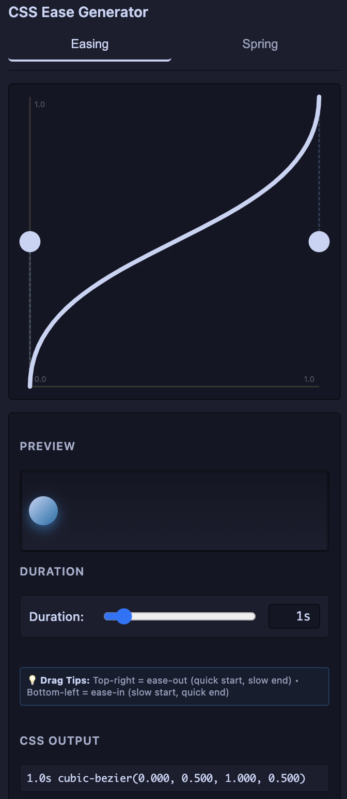

# Motion by BaZz

Visually design CSS animations with cubic-bezier curves or spring physics - generate production-ready code with instant previews.



A VS Code extension that helps you generate CSS easing values from interactive motion editor graphs. Choose between traditional **cubic-bezier curves** or professional **spring physics animations**.

## ✨ Features

### Cubic-Bezier Editor
- **Interactive Canvas Editor**: Draw and edit easing curves on a canvas
- **Control Points**: Drag control points to adjust your easing curve
- **Live Preview**: See a preview animation using your easing function
- **CSS Output**: Get cubic-bezier values ready for CSS
- **Copy to Clipboard**: One-click copy functionality for generated values

### 🎯 Spring Physics Engine (NEW!)
- **Professional Spring Physics**: Industry-standard damped harmonic oscillator model
- **Three Core Parameters**:
  - **Stiffness** (50-500): Control spring tightness
  - **Damping** (5-100): Control bounce and oscillation
  - **Mass** (0.1-5): Control momentum and inertia
- **Spring Presets**: Ready-made configurations (Gentle, Standard, Snappy, Bouncy, Molasses, Springy)
- **Real-time Visualization**: See your spring curve update instantly
- **CSS linear() Easing**: Generate modern CSS animations with precise keyframes
- **Spring Analysis**: Understand damping type, oscillations, settling time, and overshoot

## 📖 Usage

### Cubic-Bezier Mode

1. Open the Motion Editor from the sidebar (Activity Bar)
2. Click the "Easing" tab
3. Draw your easing curve by dragging the control points on the canvas
4. See the CSS output and preview animation
5. Click "Copy to Clipboard" to copy the cubic-bezier value

### Spring Physics Mode

1. Open the Motion Editor from the sidebar
2. Click the **Spring** tab
3. Adjust the sliders:
   - **Duration**: Total animation time
   - **Bounciness**: Higher = more bounce, lower = smoother
4. Watch the real-time preview of your spring animation
5. Copy the generated `linear()` easing function to your CSS
6. Use the preset buttons for quick configuration changes

## 🎨 Spring Physics Presets

| Preset | Feel | Best For |
|--------|------|----------|
| **Gentle** | Soft, slow | UI entrance animations |
| **Standard** | Balanced, natural | General purpose animations |
| **Snappy** | Quick, responsive | Interactive elements |
| **Bouncy** | Playful, lively | Attention-grabbing effects |
| **Molasses** | Smooth, elegant | Smooth transitions |
| **Springy** | Modern, dynamic | Drag-and-drop animations |

## 🔧 How It Works

### Cubic-Bezier Mode
The extension uses cubic-bezier curves with two control points (P1 and P2). The curve starts at (0, 0) and ends at (1, 1).

- **Control Points**: Drag these points to shape your easing curve
- **Grid**: The grid helps you position points precisely
- **Preview**: The animated box shows how your easing affects motion
- **CSS Output**: The cubic-bezier function is updated in real-time

### Spring Physics Mode
Uses the **damped harmonic oscillator** physics model:

```
x(t) = 1 - e^(-ζω₀t)[cos(ωdt) + (ζω₀/ωd)sin(ωdt)]
```

Where:
- **ω₀** = √(k/m) — Natural frequency
- **ζ** = c/(2√(km)) — Damping ratio
- **ωd** = ω₀√(1-ζ²) — Damped frequency

This is the same physics engine used by React Spring, Framer Motion, and Anime.js!

## 📚 Documentation

For detailed information about spring physics:
- **[SPRING_PHYSICS_GUIDE.md](./SPRING_PHYSICS_GUIDE.md)** - Complete spring physics reference
- **[SPRING_PHYSICS_EXAMPLES.ts](./SPRING_PHYSICS_EXAMPLES.ts)** - Code examples and use cases

## 🚀 Programmatic Usage

You can import the spring physics engine directly in your TypeScript/JavaScript projects:

```typescript
import {
  calculateSpringValue,
  generateLinearEasing,
  generateCSSCode,
  SPRING_PRESETS,
  analyzeSpring
} from './spring-physics';

// Use a preset
const config = SPRING_PRESETS.snappy;
const duration = 1.5; // seconds

// Generate CSS code
const css = generateCSSCode(config, duration);

// Analyze spring behavior
const analysis = analyzeSpring(config, duration);
console.log(analysis.description);
```

See **SPRING_PHYSICS_EXAMPLES.ts** for more examples!

## Requirements

- VS Code 1.109.0 or higher
- Modern browser with support for CSS `linear()` easing functions

## Development

To run and test this extension:

1. `npm install` - Install dependencies
2. `npm run compile` - Compile TypeScript
3. `npm run watch` - Watch for file changes and recompile
4. Press `F5` in VS Code to launch the extension in debug mode
5. Open the Motion Editor view from the sidebar (Activity Bar)

## Release Notes

### 0.0.2
- 🎉 Added professional spring physics engine
- 🎯 Bounciness slider for easy spring configuration
- 📊 Real-time spring curve visualization
- 🔧 Spring preset configurations
- 📚 Comprehensive spring physics documentation
- ✨ TypeScript spring physics module for programmatic use
- 🎨 Synchronized easing and spring previews
- 📌 Sidebar-only extension for streamlined workflow

### 0.0.1
- Initial release
- Interactive easing curve editor with canvas
- Cubic-bezier value generation
- Copy to clipboard functionality
- Live preview animation
